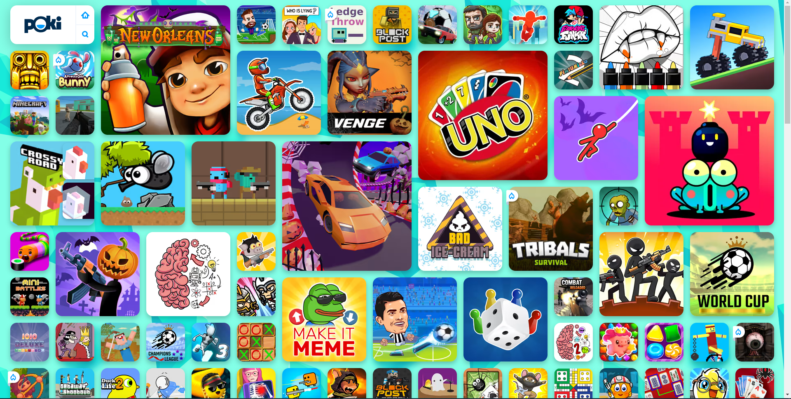
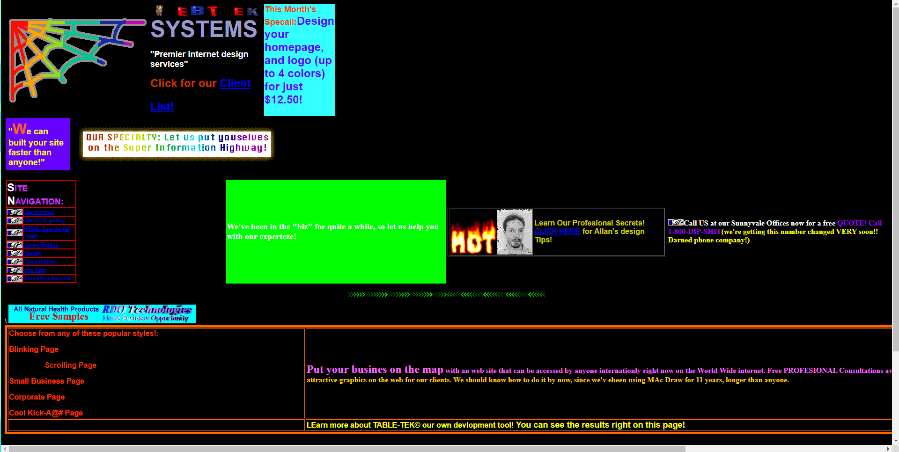
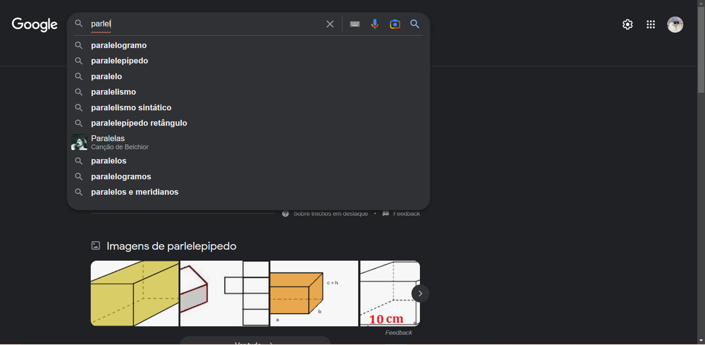

<h1 align="center">Projeto 1</h1>

Objetivo: apresentar conceitos fundamentais de usabilidade, acessibilidade, UX e etc

<h2>1. Perceptível</h2>

<h4>ERRO - 1.4.5-Images of Text Level AA (Poki.com.br - Jogos online grátis)</h4>

O site apresenta imagens de jogos, os quais não possuem identificação textual ou descrição prévia sobre do que se trata os jogos. Além de, por apresentar demasiadas imagens, polui a tela e dificulta o entendimento do usuário, podendo causar cansaço mental.

<h2>2. Operável</h2>

<h4>ERRO - 2.3.1-Three Flashes or Below Threshold Level A (dokimos.org)</h4>

Por conta de utilizar de cores vibrantes, ter uma animação em loop e elementos piscantes, o site oferece um grave risco a saúde do usuário, uma vez que pode causar convulsões no mesmo.

<h2>3. Compreensivo</h2>

<h4>ERRO - 3.1.6-Pronunciation Level AAA</h4>

O site falha com essa heurística ao apresentar textos gramaticalmente errados da lingua inglesa, de modo que confunde a usabilidade tanto dos usuários com vasto entendimento da língua quanto aqueles que não possuem tal conhecimento.

<h4>ACERTO - 3.3.1-Error Identification Level A</h4>

Na barra de pesquisa do Google, ele evita o usuário de cometer erros e ainda apresenta outros possíveis resultados.

