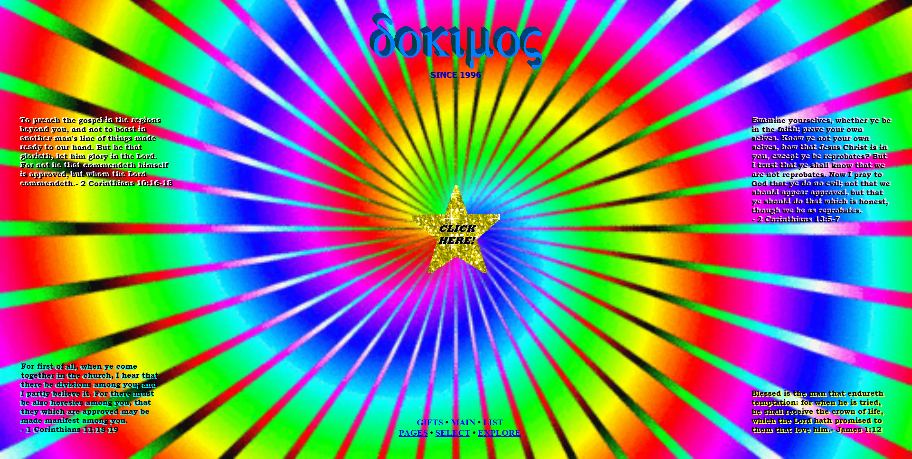

<h1 align="center">Projeto 1</h1>

Objetivo: apresentar conceitos fundamentais de usabilidade, acessibilidade, UX e etc

<h2>1. Perceptível</h2>
<h3>1.3.4 - Orientation Level AA (SIGA-home)</h3>

O site não apresenta CSS que permite a visão tanto em paisagem quanto em retrato. De modo que dificulta a apresentação e a usabilidade do usário do site em questão.

<h3>1.4.5 - Images of Text Level AA (Poki.com.br - Jogos online grátis)</h3>

<h2>2. Operável</h2>
<h3>2.3.1 - Three Flashes or Below Threshold Level A (dokimos.org)</h3>

O site possui uma animação em loop de cores vibrantes, podendo causar ataques epilépticos ao usuário

<h2>3. Compreensivo</h2>

<h2>4. Robusto</h2>
